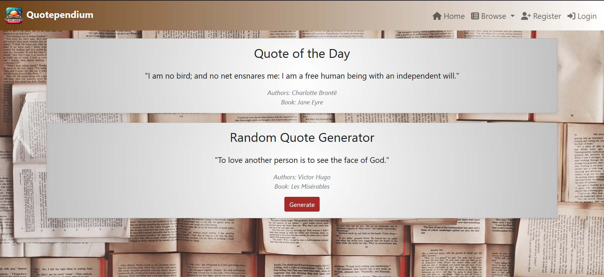
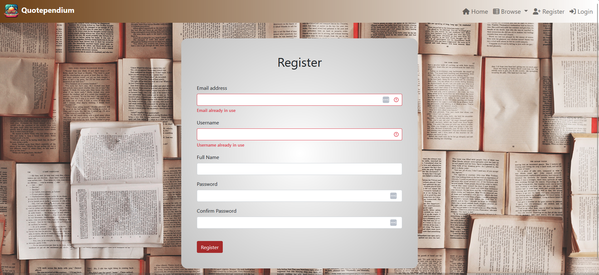
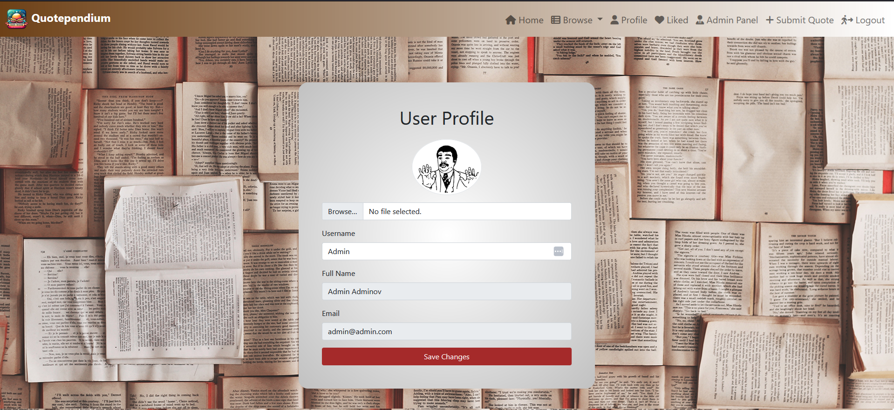
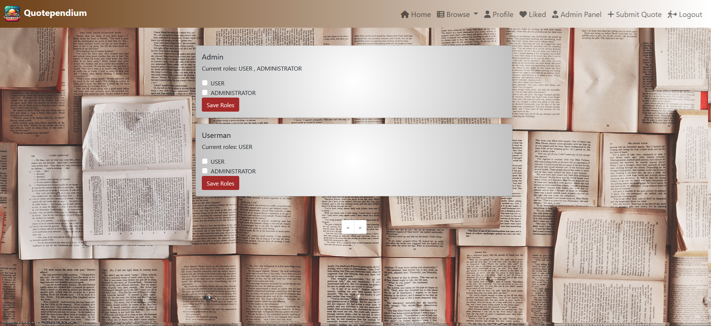
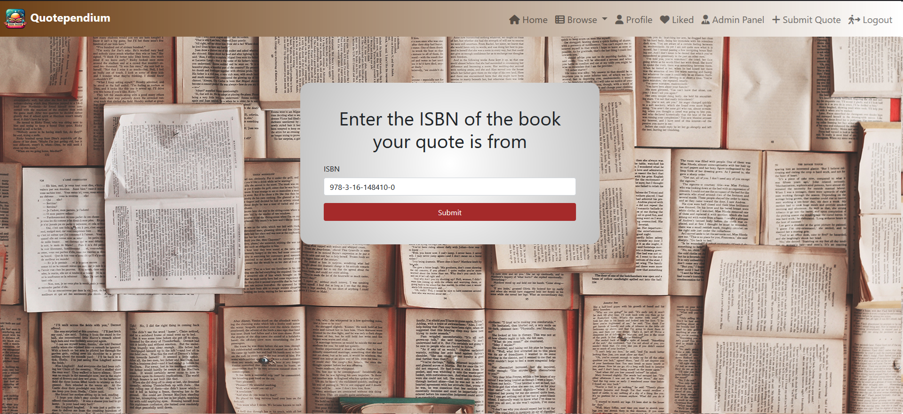
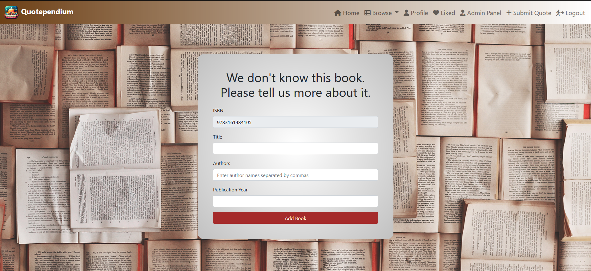
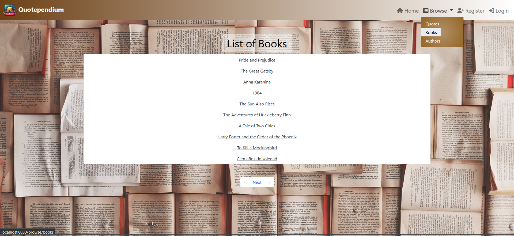
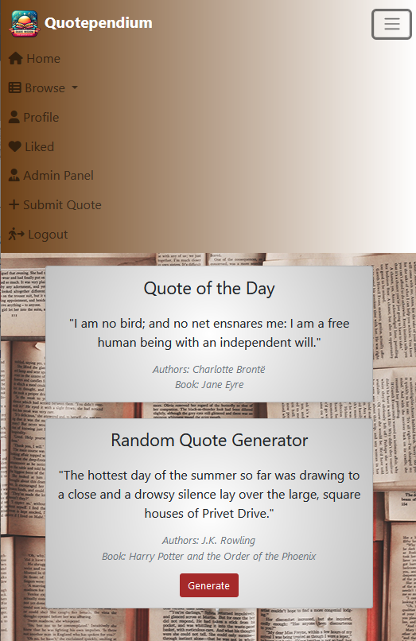

# Quotependium

Quotependium is a web application designed for managing and sharing quotes from books. This application allows users to contribute and discover memorable quotes, providing a community-driven platform for literary enthusiasts.

## Features

- **User Contributions**: Add and manage quotes and books.
- **User Profile Management**: Edit usernames and profile pictures.
- **Quote Management**: Save favourite quotes to account.
- **Random Quote Generator**: Display random quotes on the front page.
- **Quote of the Day**: Scheduled daily quote display.
- **Admin Panel**: Manage user roles and permissions.
- **Security**: User authentication and authorization using Spring Security.

## Technologies Used

- **Backend**: Spring Boot, Hibernate, Fetch API
- **Frontend**: HTML, CSS, JavaScript, Thymeleaf, Bootstrap
- **Database**: MySQL
- **Security**: Spring Security

## API Endpoints

### Get Quote by ID
- **Endpoint**: `/api/quotes/{id}`
- **Method**: GET
- **Description**: Retrieve a specific quote by its ID.

### Get Random Quote
- **Endpoint**: `/api/quotes/random`
- **Method**: GET
- **Description**: Retrieve a random quote.

## Screenshots
### Home Page

### Registration
Registration and login pages have field validations

### User Profile

### Admin Panel

### Submit ISBN
Accepts 13-digit ISBNs. They can be entered either as clean numbers, with spaces, with dashes, or with "ISBN" at the start. The backend converts them to clean numbers.

### Submit New Book
When the book with the given ISBN is not in the database, Quotependium prompts the user to enter information about it before submitting their quote.

### Browse Quotes, Books, and Authors

### Dynamic Layout for Mobile

## License
This project is licensed under the MIT License.
